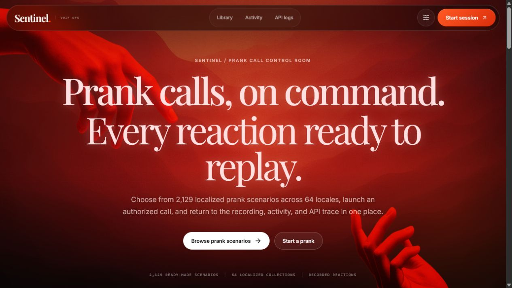
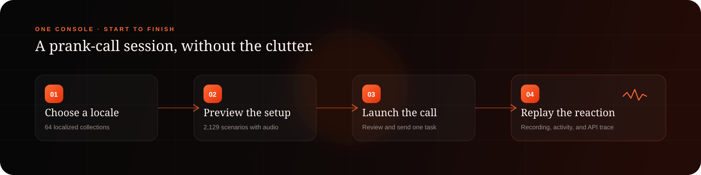
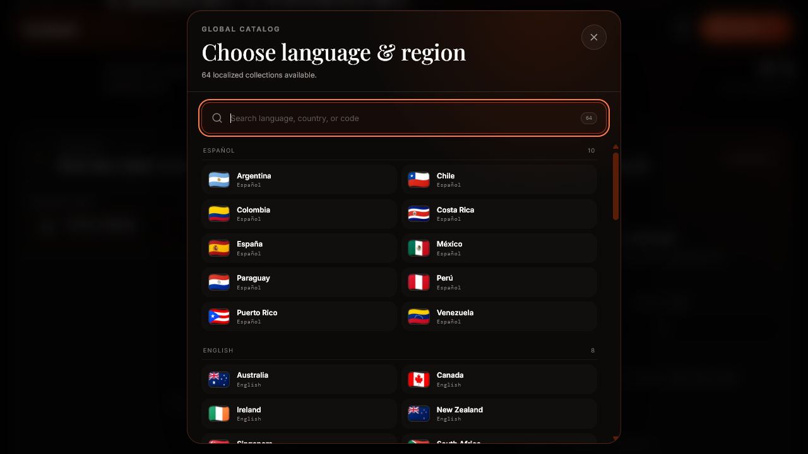
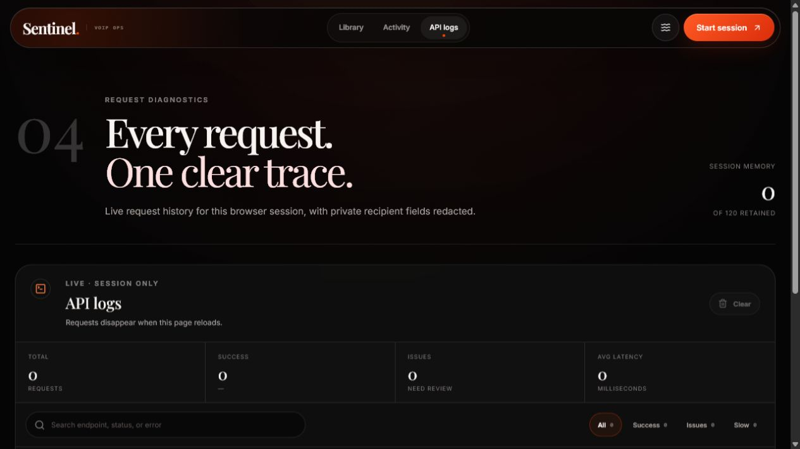

<div align="center">
  
  <h1>Sentinel VOIP</h1>
  <p><strong>Prank calls, on command.</strong></p>
  <p>Choose a localized scenario, preview the setup, launch an authorized call, and follow the recording and request trail from one focused console.</p>
  <p><code>React 19</code> · <code>Vite 8</code> · <code>2,129 scenarios</code> · <code>64 locales</code></p>
</div>



## One console, start to finish

Sentinel turns the existing call flow into a clear browser workspace. The catalog, session composer, returned recordings, and request diagnostics stay connected instead of living in separate tools.



## Built for the full session

<table>
  <tr>
    <td width="50%">
      
    </td>
    <td width="50%">
      
    </td>
  </tr>
  <tr>
    <td><strong>Language-first discovery</strong><br />Search 64 localized collections, then browse and preview the matching prank scenarios.</td>
    <td><strong>Readable request diagnostics</strong><br />Filter outcomes, scan latency, expand sanitized payloads, and copy the event you need.</td>
  </tr>
</table>

- **Scenario library** — Search titles and descriptions, filter by language and region, preview audio, and carry a selection into the session workspace.
- **Session workbench** — Review the scenario, recipient, country code, and dial ID before sending one backend task.
- **Activity and recordings** — Reconnect browser-saved identities with returned records, status, recipient context, and playable audio.
- **API logs** — Keep the latest 120 requests in session memory with status filters, timing summaries, expandable payloads, and recursive recipient-field redaction.
- **Motion controls** — Use the full visual treatment or switch to the reduced-motion experience at any time.

## Quick start

### Requirements

- Node.js `20.19+` or `22.12+`
- pnpm via Corepack

```bash
git clone https://github.com/xtofuub/Sentinel-VOIP.git
cd Sentinel-VOIP
corepack enable
pnpm install
pnpm dev
```

Open [http://localhost:5173](http://localhost:5173).

## Commands

| Command | Purpose |
| --- | --- |
| `pnpm dev` | Start the Vite development server |
| `pnpm lint` | Run the ESLint checks |
| `pnpm build` | Create the production bundle |
| `pnpm preview` | Preview the production build on port `4173` |

## How it works

1. The local catalog is normalized into 64 locale collections and 2,129 scenario records.
2. A session creates and synchronizes an identity through the existing API flow.
3. Sentinel submits the selected scenario and recipient task through the `/api` proxy.
4. Activity requests returned records and available audio for identities saved in this browser.
5. API logs keep a sanitized, in-memory trace of request outcomes and payloads.

The frontend keeps the current service contract intact. Vite proxies `/api` during development, while the production rewrite is configured in `vercel.json`.

## Current boundaries

- Calls launch immediately. Delayed scheduling is not exposed because the current backend contract does not document reliable future-time execution.
- Identities and recipient context are browser-local and can be cleared with site data.
- API logs are session-only and disappear on reload.
- Scenario images, audio previews, and live API behavior depend on their remote services.

## Responsible use

Use Sentinel only where you have permission and a lawful purpose. Comply with consent, privacy, recording, telecommunications, and anti-harassment rules that apply to you and the recipient.

## Author

Built by [xtofuub](https://github.com/xtofuub).
